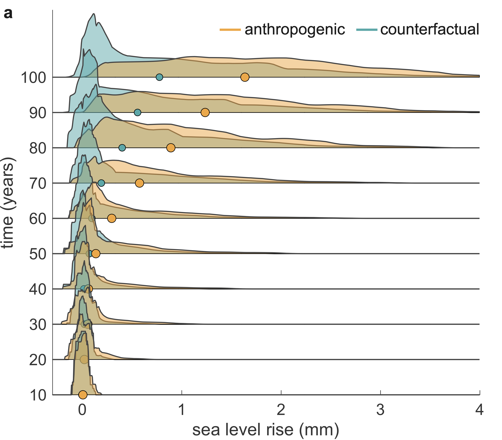

My research aims to understand the processes responsible for driving ice sheet retreat, better constrain past and future ice sheet change, and examine the implications of a changing cryosphere on societies around the world. To do so, I use mathematical and computational modelling, geophysical observations, data science, and machine learning. 

## Attributing sea level rise from the ice sheets to climate change  

Despite taking place at the same time as significnat human-induced climate change, we don't know whether climate change is actually responsible for the retreat of the ice sheets. This is in large part because it's hard to reproduce the behaviour of the ice sheets over the last few centuries, owing to a lack of observational constraints before the satellite era and models which are very sensitive to climate forcing. I am using machine learning, combined with physics-based ice sheet models, to reproduce the retreat of the ice sheets over the last centuries and thus quantify the extent to which climate change is responsible for retreat of the ice sheets. 

The image on the right show distributions of sea level rise at time slices in the future. We showed how climate change driven trends not only shift distributions towards higher values (more sea level rise expected on average) but also places more weight in tails (extreme events become more likely).

#### Publications
* Bradley, A.T., Bett, D.T., Holland, P.R., Williams, C.R., Arthern, R.J. and Rydt, J.D., 2024. [A framework for estimating the anthropogenic part of Antarctica’s sea level contribution in a synthetic setting](https://www.nature.com/articles/s43247-024-01287-w). Communications Earth & Environment, 5(1), p.121  
* Bradley, A.T., Bett, D.T., Williams, C.R., Arthern, R.J., Holland, P.R., Bryne, J., Edwards, T.L. Quantifying and attributing the role of anthropogenic climate change in industrial-era retreat of the Pine Island Glacier. Submitted to The Cryosphere

