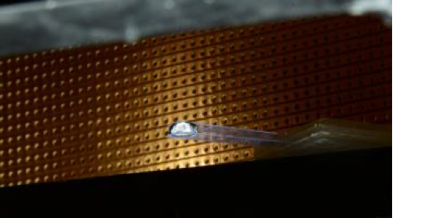

I am a climate scientist, specialising in climate modelling and uncertainties in climate model predictions. To do so, I use mathematical and computational modelling, geophysical observations, data science, and machine learning. I am particularly interested in the cryosphere, particularly ice sheets and glaciers, including the implications of a changing cryosphere on societies around the world. 

## Attributing sea level rise from the ice sheets to climate change  

Despite taking place at the same time as significnat human-induced climate change, we don't know whether climate change is actually responsible for the retreat of the ice sheets. This is in large part because it's hard to reproduce the behaviour of the ice sheets over the last few centuries, owing to a lack of observational constraints before the satellite era and models which are very sensitive to climate forcing. I am using machine learning, combined with physics-based ice sheet models, to reproduce the retreat of the ice sheets over the last centuries and thus quantify the extent to which climate change is responsible for retreat of the ice sheets. 

The image on the right show distributions of sea level rise at time slices in the future. We showed how climate change driven trends not only shift distributions towards higher values (more sea level rise expected on average) but also places more weight in tails (extreme events become more likely).

#### Publications
* Bradley, A.T., Bett, D.T., Holland, P.R., Williams, C.R., Arthern, R.J. and Rydt, J.D., 2024. [A framework for estimating the anthropogenic part of Antarctica’s sea level contribution in a synthetic setting](https://www.nature.com/articles/s43247-024-01287-w). Communications Earth & Environment, 5(1), p.121  
* Bradley, A.T., Bett, D.T., Williams, C.R., Arthern, R.J., Holland, P.R., Bryne, J., Edwards, T.L. Quantifying and attributing the role of anthropogenic climate change in industrial-era retreat of the Pine Island Glacier. Submitted to The Cryosphere

## Understanding ice sheet processes
Why are some glaciers and ice sheets shrinking faster than others? Why do ice sheet models underpredict recent rates of retreat? Could ice sheets pass tipping-points, in which they retreat irreversibly? In order to answer these questions (and more!) we need to better understand the processes driving their retreat.

#### Publications
* Bradley, A.T., Bett, D.T., Dutrieux, P., De Rydt, J. and Holland, P.R., 2022. [The influence of Pine Island Ice Shelf calving on basal melting. Journal of Geophysical Research: Oceans](https://agupubs.onlinelibrary.wiley.com/doi/full/10.1029/2022JC018621), 127(9), p.e2022JC018621.
* Bradley, A.T., De Rydt, J., Bett, D.T., Dutrieux, P. and Holland, P.R., 2022. [The ice dynamic and melting response of Pine Island Ice Shelf to calving. Annals of Glaciology](https://www.cambridge.org/core/journals/annals-of-glaciology/article/ice-dynamic-and-melting-response-of-pine-island-ice-shelf-to-calving/46ABBC366EA9B8312ADD0A43DA24B1A6), 63(87-89), pp.111-115.  
* Bradley, A.T. and Hewitt, I.J., 2024. [Tipping point in ice-sheet grounding-zone melting due to ocean water intrusion](https://www.nature.com/articles/s41561-024-01465-7). Nature Geoscience, 17(7), pp.631-637.

## Projecting (and quantifying uncertainties in) future sea level rise 
Sea level rise from the ice sheets and glaciers could fundamentally alter coastlines around the world, with significant socio-economic and ecological impacts. However, how much the sea level will rise in the future is highly uncertain. Ongoing research aims to predict how much the sea level will rise and quantify uncertainties in these predictions, using computational models and machine learning.

#### Publications
* Bett, D.T., Bradley, A.T., Williams, C.R., Holland, P.R., Arthern, R.J. and Goldberg, D.N., 2024. [Coupled ice–ocean interactions during future retreat of West Antarctic ice streams in the Amundsen Sea sector](https://tc.copernicus.org/articles/18/2653/2024/tc-18-2653-2024.html). The Cryosphere, 18(6), pp.2653-2675.  

## Developing climate models
Climate models are vital tools to understand the response of the climate system to climatic change, both in the past and in the future. Recently, we have been developing coupled ice-ocean models, in which the ocean component is fully resolved (rather than parametrized, as in most ice sheet models). This model is coupled to the [WAVI.jl](https://rjarthern.github.io/WAVI.jl/) ice sheet model, a fast, flexible, and friendly ice sheet model written in Julia.

#### Publications
* Bett, D.T., Bradley, A.T., Williams, C.R., Holland, P.R., Arthern, R.J. and Goldberg, D.N., 2024. [Coupled ice–ocean interactions during future retreat of West Antarctic ice streams in the Amundsen Sea sector](https://tc.copernicus.org/articles/18/2653/2024/tc-18-2653-2024.html). The Cryosphere, 18(6), pp.2653-2675.  
* Bradley, A.T., Arthern, R.J., Bett, D.T., Williams, C.R. and Byrne, J., 2024. [WAVI. jl: Ice Sheet Modelling in Julia. Journal of Open Source Software](https://joss.theoj.org/papers/10.21105/joss.05584.pdf), 9(95), p.5584.  

## (Previously) Droplet Dynamics

My PhD was concerned with  *bendotaxis*, an elastocapillary droplet transport mechanism that is both passive (i.e. requires no external energy input) and, surprisingly, moves droplets in the same direction regardless of whether they wet the channel or not.

This work was undertaken under the fantastic supervision of [Prof. Dominic Vella](https://people.maths.ox.ac.uk/vella/index.html) and [Prof. Ian Hewitt](https://people.maths.ox.ac.uk/hewitt/).

#### Publications
* Bradley, A.T., Box, F., Hewitt, I.J. and Vella, D., 2019. [Wettability-independent droplet transport by Bendotaxis](https://journals.aps.org/prl/abstract/10.1103/PhysRevLett.122.074503). Physical review letters, 122(7), p.074503.  
* Bradley, A.T., Hewitt, I.J. and Vella, D., 2021. [Droplet trapping in bendotaxis caused by contact angle hysteresis](https://journals.aps.org/prfluids/abstract/10.1103/PhysRevFluids.6.114003). Physical Review Fluids, 6(11), p.114003.
* Bradley, A.T., Hewitt, I.J. and Vella, D., 2023. [Bendocapillary instability of liquid in a flexible-walled channel](https://www.cambridge.org/core/journals/journal-of-fluid-mechanics/article/bendocapillary-instability-of-liquid-in-a-flexiblewalled-channel/BC9E4559D7724B7E045509BA3BAB216D). Journal of Fluid Mechanics, 955, p.A26.

