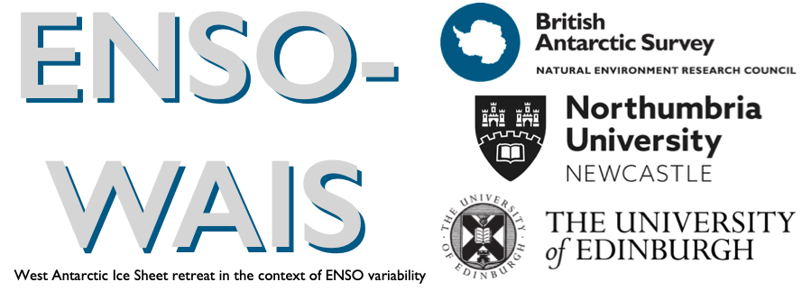
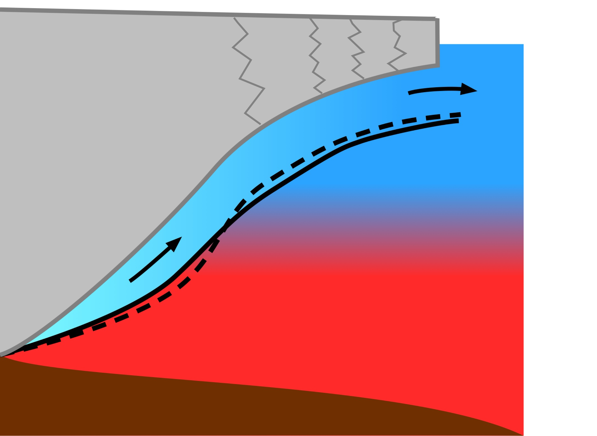
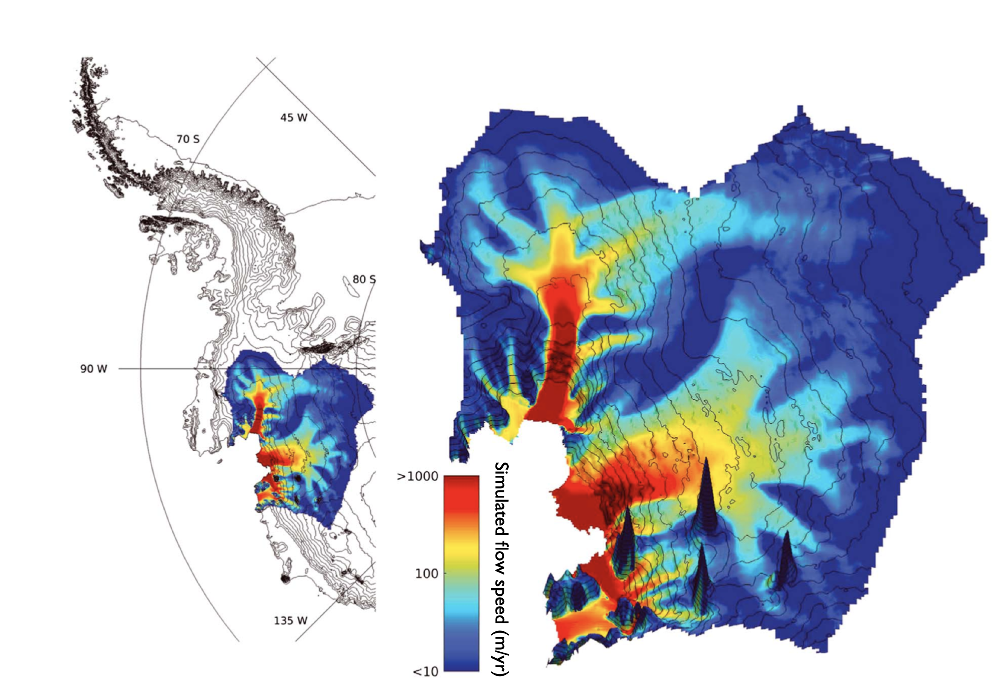

## Quantifying the impact of ENSO of West Antarctic Ice Sheet retreat

Recent studies highlight the influence of El Niño Southern Oscillation (ENSO) on the rate of ice loss from West Antarctica. As part of the ENSOWAIS project, I aim to quantify the probability that (1) 20th Century retreat of the West Antarctic Ice sheet was triggered by ENSO, (2) sequential La Niña events could halt the retreat happening now, and (3) formally attribute the changes in Western Antarctica to ENSO or anthropogenic trends in zonal winds.

## How does the geometry of ice shelf cavities affect melt rates?

The geometry of melt rate cavities is not static: e.g. ice dynamics result in changes in the shape of the ice shelf draft, and calving reduces the extent of ice shelves. Such changes in geometry are sometimes overlooked as a driver on changes in melt rate, and are rarely accounted for in parametrizations of melt rates, which are required in century scale simulations of West Antarctic Ice Sheet Retreat.

#### Publications
* The Influence of Pine Island Ice Shelf Calving on Melting ([essoar preprint](https://www.essoar.org/doi/abs/10.1002/essoar.10510805.1)), **A. T. Bradley**, D. Bett, P. Dutrieux, J. De Rydt, P. R. Holland
* [Asymptotic Analysis of Subglacial Plumes in Stratified Environment](hhttps://royalsocietypublishing.org/doi/10.1098/rspa.2021.0846), **A. T. Bradley**, C. R. Williams, A. Jenkins, R. Arthern

## Ice Sheet Modelling

Ice sheet models do not have a reputation for being particularly accessible. To address this, I have, alongside modellers at BAS, been developing 'WAVI.jl', the first hybrid ice sheet model written in Julia. WAVI.jl is fast and flexible enough to be used by researchers, yet simple and friendly enough to be accessible to students and first time programmers.

#### Publications
* WAVI.jl: Ice Sheet Modelling in Julia [forthcoming], **A. T. Bradley** and R. Arthern 

## Droplet Dynamics

My dPhil was concerned with  *bendotaxis*, an elastocapillary droplet transport mechanism that is both passive (i.e. requires no external energy input) and, surprisingly, moves droplets in the same direction regardless of whether they wet the channel or not.

This work was undertaken under the fantastic supervision of [Prof. Dominic Vella](https://people.maths.ox.ac.uk/vella/index.html) and [Prof. Ian Hewitt](https://people.maths.ox.ac.uk/hewitt/).

#### Publications
* [Wettability-independent droplet transport by Bendotaxis](https://doi.org/10.1103/PhysRevLett.122.074503), **A. T. Bradley**, F. Box, I. J. Hewitt and D. Vella, Phys. Rev. Lett. 122 074503 (2019)
* [Droplet transport by bendotaxis](https://ora.ox.ac.uk/objects/uuid:8ed6f6b0-a809-4b3b-986e-c990f75b4f7f) [PhD Thesis], **A. T. Bradley**, University of Oxford, 2020
* [Droplet trapping in bendotaxis caused by contact angle hysteresis](https://journals.aps.org/prfluids/abstract/10.1103/PhysRevFluids.6.114003)  **A. T. Bradley**, I. J. Hewitt and D. Vella, Phys. Rev. Fluids 6, 114003 (2020)
* Bendocapillary Instability of Liquid in a Flexible-Walled Channel ([arxiv preprint](https://arxiv.org/abs/2201.01103]  **A. T. Bradley**, I. J. Hewitt and D. Vella

#### Press
* [physicsworld](https://physicsworld.com/a/droplets-move-through-narrow-channel-by-bending-the-walls/), [Nature Research Highlight](https://www.nature.com/articles/d41586-019-00701-0), [phys.org](https://phys.org/news/2019-02-liquid-channel.html), [Wissenschaft aktuell](https://www.wissenschaft-aktuell.de/artikel/Autark_rinnende_Tropfen_1771015590677.html), [Welt der Physik](https://www.weltderphysik.de/gebiet/materie/news/2019/wie-sich-tropfen-selbst-antreiben/), [Physics](https://physics.aps.org/articles/v12/18), [Oxford Mathematics Case Study](https://www.maths.ox.ac.uk/node/31816)
