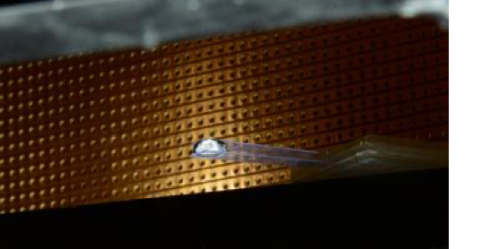

*NB: this page is a little out of date, but gives you an idea of what I work on*
I apply numerical, statistical, and analytic methods to help answer questions relating to the cryosphere. I use models, from simple schematic models to large general circulation models, to address questions relating to the changes we observe and to simulate those that may occur in the future. I am also interested in the public policy implications associated with a changing cryosphere.

## Ice Shelf Processes: Melting and Calving

Ice shelves play an integral role in modulating sea level rise by buttressing the adjoining grounded ice. Ice shelves lose mass predominantly via calving and melting, which have typically been assumed to be largely independent of one another. However, calving affects ice shelf cavities, with the potential to change melt rates and changes in melt rates change ice shelf properties, with the potential to alter calving and crevassing processes. I am trying to understand how calving and melting interact, and what are the implications of these for ice dynamics? 

More broadly, ice shelf collapse is an example of a (possibly) low likelihood, high impact event; understanding such events allows us to constrain high end ice loss under future warming scenarios.

#### Publications
* Timescales of ice shelf collapse via crevassing _in prep_
**A. T. Bradley**, C. Y. Lai, N. Coffey
* [The ice dynamic and melting response of Pine Island Ice Shelf to calving](https://www.cambridge.org/core/journals/annals-of-glaciology/article/ice-dynamic-and-melting-response-of-pine-island-ice-shelf-to-calving/46ABBC366EA9B8312ADD0A43DA24B1A6)
**A. T. Bradley**, J. De Rydt, D. Bett, P. Dutrieux and P. Holland   
* [The influence of Pine Island Ice Shelf calving on melting](https://agupubs.onlinelibrary.wiley.com/doi/full/10.1029/2022JC018621)
**A. T. Bradley**, D. Bett, P. Dutrieux, J. De Rydt and P. Holland  
_Journal of Geophysical Research: Oceans, 127 (2022)_  ([essoar](https://www.essoar.org/doi/abs/10.1002/essoar.10510805.1))  

## Sea Level Rise
The Antarctic and Greenland ice sheets represent the biggest uncertainties in future sea level rise projections. By studing the behaviour of these ice sheets on both small and large scales, we can improve future predictions of ice sheet mass loss.

### From small scales...
In climate models, many processes are parametrized for computation tractability. In ice sheet models in particular, these are often related to melting, both at the grounding line and on the ice shelf itself. I use reduced complexity models, asymptotic methods, and ocean models to try to constrain these processes.

#### Publications
* Tipping point behaviour of submarine melting in ice-sheet grounding zones _in review_, **A. T. Bradley** and I. J. Hewitt

* [Asymptotic Analysis of Subglacial Plumes in Stratified Environment](https://royalsocietypublishing.org/doi/10.1098/rspa.2021.0846), **A. T. Bradley**, C. R. Williams, A. Jenkins, R. Arthern

### ...to large scales
Bayesian calibration methods can be used to refine predictions of future Antarctic ice sheet loss. Currently, I am applying such methods to help to quantify the impact of the El-Niño Southern Oscillation on the past and future rate of ice loss from West Antarctica. 

#### Publications
* [WAVI.jl: Ice Sheet Modelling in Julia](https://joss.theoj.org/papers/10.21105/joss.05584) **A. T. Bradley**, R. J. Arthern, D. T. Bett, C. R. Williams, J. Byrne

## Cryosphere Attribution 
Attribution science seeks to describe, quantitatively, the effect of climate change on weather events. Given the long timescales involved, ice sheet evolution can also be considered a "weather event". However, despite its ubiquity in images of climate change, there has been no formal attribution of changes to the Antarctic or Greenland ice sheets to climate change. 

#### Publications
* [A framework for estimating the anthropogenic part of Antarctica’s sea level contribution in a synthetic setting](https://www.nature.com/articles/s43247-024-01287-w)
**A. T. Bradley**, R. J. Arthern, C. R. Williams, D. Bett, J. De Rydt, P. Holland 

## Droplet Dynamics

My PhD was concerned with  *bendotaxis*, an elastocapillary droplet transport mechanism that is both passive (i.e. requires no external energy input) and, surprisingly, moves droplets in the same direction regardless of whether they wet the channel or not.

This work was undertaken under the fantastic supervision of [Prof. Dominic Vella](https://people.maths.ox.ac.uk/vella/index.html) and [Prof. Ian Hewitt](https://people.maths.ox.ac.uk/hewitt/).

#### Publications
* [Wettability-independent droplet transport by Bendotaxis](https://doi.org/10.1103/PhysRevLett.122.074503), **A. T. Bradley**, F. Box, I. J. Hewitt and D. Vella, Phys. Rev. Lett. 122 074503 (2019)
* [Droplet transport by bendotaxis](https://ora.ox.ac.uk/objects/uuid:8ed6f6b0-a809-4b3b-986e-c990f75b4f7f) [PhD Thesis], **A. T. Bradley**, University of Oxford, 2020
* [Droplet trapping in bendotaxis caused by contact angle hysteresis](https://journals.aps.org/prfluids/abstract/10.1103/PhysRevFluids.6.114003)  **A. T. Bradley**, I. J. Hewitt and D. Vella, Phys. Rev. Fluids 6, 114003 (2020)
* [Bendocapillary Instability of Liquid in a Flexible-Walled Channel](https://www.cambridge.org/core/journals/journal-of-fluid-mechanics/article/bendocapillary-instability-of-liquid-in-a-flexiblewalled-channel/BC9E4559D7724B7E045509BA3BAB216D) **A. T. Bradley**, I. J. Hewitt and D. Vella

#### Press
* [physicsworld](https://physicsworld.com/a/droplets-move-through-narrow-channel-by-bending-the-walls/), [Nature Research Highlight](https://www.nature.com/articles/d41586-019-00701-0), [phys.org](https://phys.org/news/2019-02-liquid-channel.html), [Wissenschaft aktuell](https://www.wissenschaft-aktuell.de/artikel/Autark_rinnende_Tropfen_1771015590677.html), [Welt der Physik](https://www.weltderphysik.de/gebiet/materie/news/2019/wie-sich-tropfen-selbst-antreiben/), [Physics](https://physics.aps.org/articles/v12/18), [Oxford Mathematics Case Study](https://www.maths.ox.ac.uk/node/31816)
